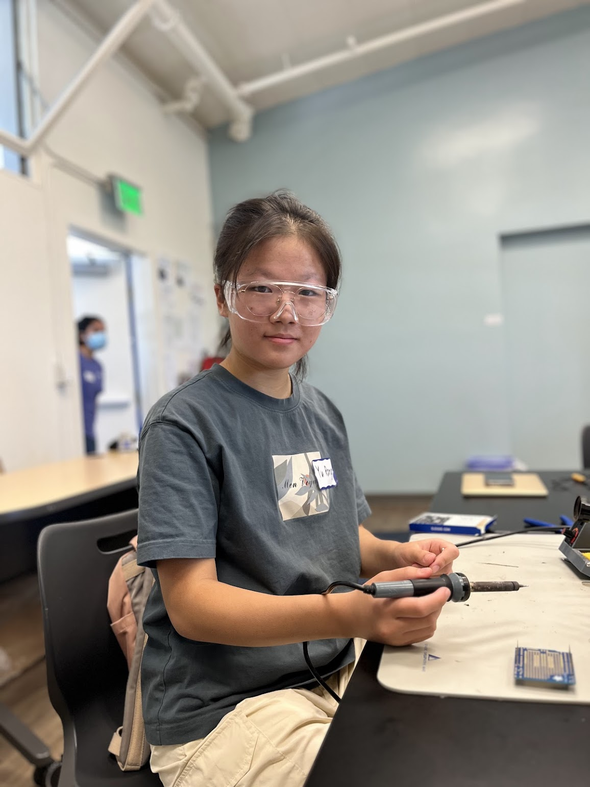

# Posture Corrector
Ever wondered how mastering good posture can transform your confidence and presence? Cleveland clinic states that standing and sitting up straight can boost confidence and reduced risk of injury. 
My project is aim to help people to correct sitting posture and remind them anytime.
What sets this project apart is the incorporation of numerous innovative features.
At first I...
These experiences have significantly enhanced my problem-solving skills.

| **Engineer** | **School** | **Area of Interest** | **Grade** |
|:--:|:--:|:--:|:--:|
| Mila R. | Saratoga High School | Engineering | Incoming Sophomore



# Final Milestone
<iframe width="560" height="315" src="https://www.youtube.com/embed/GOSmVSnR1x4?si=L0vsJwBKRm38Qdbn" title="YouTube video player" frameborder="0" allow="accelerometer; autoplay; clipboard-write; encrypted-media; gyroscope; picture-in-picture; web-share" referrerpolicy="strict-origin-when-cross-origin" allowfullscreen></iframe>
My final milestone was to connect the previous project to a vest and add two servos to physically correct posture. To connect the flex sensor and the LED stripe to the vest, I used tape, extended the wires from Arduino and then put two sides of LED stripe to the vest's pockets. 
In order to make a servo system, I program to let the servo rotate 180 degrees. On hardware, I fix the two servos by using the non-elastic belt with the rotation direction facing outward as well as rotate from top to bottom. One end is connected to the half of fan blades, and the other end is sewn under the shoulders. One end of the other belt is connected to the servo body with Velcro, and the other end is connected to the thigh wearable device. 
One challenge taht I had for this milestone was the servo part. At first, I tried to use elastic belt and connect two servos directly to waist of the vest, which won't have any force. By getting to know a existing product from a instructor, I learnt the working principle and fix servos to the legs to pull the shoulders by using non-elastic belt. One thing that I would do to improve my project is to improve the long distance cable stability and turn the soldered Arduino into a portable device. If I have more time, I also plan to add buzzers on my shoulder to achieve better prompt effect.

# Second Milestone
<iframe width="560" height="315" src="https://www.youtube.com/embed/D_C1XX4vULE?si=S7-5pDSRuzCl-kvY" title="YouTube video player" frameborder="0" allow="accelerometer; autoplay; clipboard-write; encrypted-media; gyroscope; picture-in-picture; web-share" referrerpolicy="strict-origin-when-cross-origin" allowfullscreen></iframe>
My second Milestone was to invent an app called AlignMe so that the user can conveniently be reminded on the phone. In my project, the user sits with a flex sensor in the back of the wearable device. Then, they press the ON button to allow the function and press the RESET button to reset the Arduino code and turn off the reminder.
In order to send the user notifications on a phone, I first create an app on MIT app inventor which connected to my arduino via a bluetooth module. The bluetooth module sends data from the arduino to the app wirelessly. In order for the app to update in real time, I add a clock timer through editing blocks on the MIT APP inventor. Every 0.1 sec, the Android phone communicates with the bluetooth module, which is sending variable "global command" and receiving a one byte variable "Global Recieve_byte". The global command will turn to number 1 when the user presses the ON button and turns to 3 when press RESET button. After the Arduino receives the global command at a speed of 9600 baud, it can determine whether to Serial.print a number back or reset the Arduino based on this. If the reminder function is on, the flex value is greater (less) than 15, the Arduino will send 5(6) to the Android phone and it will print out "Bad posture!"("Good posture.") on the screen.
One challenge that I had for this milestone was the coding part. I used the Serial.write and Serial.flush wrong at first because I wasn't clear with how the difference between print and write is that serial.print sends characters while serial.write only sends binary. A character is one byte while binary deals with bits. After changing to Serial.print, I found the app can't receive the Recieve_byte. I utilize the ASCII code to transfer numbers, which is an encoding standard used to represent text in computers. Last, I overcame the challenge of how to avoid printing many lines of reminder text by adding a global variable block that can receive redundant text at the end of the loop. 

# First Milestone
<iframe width="560" height="315" src="https://www.youtube.com/embed/qWUt8Wl382Y?si=09idMhwT-X0u8iI2" title="YouTube video player" frameborder="0" allow="accelerometer; autoplay; clipboard-write; encrypted-media; gyroscope; picture-in-picture; web-share" referrerpolicy="strict-origin-when-cross-origin" allowfullscreen></iframe>

My first mile stone is to complete the flex sensor connection, program the arduino with required code and make sure the flex sensor works. My first step is to make images of WS2812b led strip and flex sensor schematics. The pressure that the flex sensor senses is then set as the baseline pressure for the user. If they lean back and slouch into a bad sitting posture, an LED stripe will be trigged. 
After solding wires and connecting, I programed code. 
First, I wrote a if sentence to accomplish the LED stripe real time turn red when the flex sencor bend over an expected critical value; Turn green sequentially when the flex sensor is less than expected value. With the help of Adafruit_NeoPixel library and a for loop, the computer can control color, brightness, LED amount and time to turn on of the LEDs.
One challenge that I had for this milestone was the LED was always red when the value represents flex sensor bend degree is 0. It's because the else sentence isn't excuted. I didn’t get to know well the Adafruit_NeoPixel library dictionary, so I omissioned the strip.show() that refresh the display for these changes to take effect.
My next step is to enable the project connection with a Android phone program to have a higher degree of completion.
# Schematics 
WS2812b LED Strip

Flex sensor

HC-05 Bluetooth Module


# Bill of Materials

| **Part** | **Note** | **Price** | **Link** |
|:--:|:--:|:--:|:--:|
| Arduino Uno | Open source microcontroller used to read inputs | $28.50  | <a href="https://www.amazon.com/Arduino-A000066-ARDUINO-UNO-R3/dp/B008GRTSV6/ref=sr_1_3?crid=3VNEAL981J2CL&keywords=arduino+uno&qid=1685848547&sprefix=arduino%2Caps%2C170&sr=8-3"> Link </a> |
|:--:|:--:|:--:|:--:|
| Breadboard | Used to build circuts | $5.99 | <a href="https://www.amazon.com/Qunqi-point-Experiment-Breadboard-5-5%C3%978-2%C3%970-85cm/dp/B0135IQ0ZC/ref=sr_1_10?crid=2NREO3D61OYUY&keywords=breadboard&qid=1687992200&sprefix=breadboar%2Caps%2C210&sr=8-10"> Link </a> |
|:--:|:--:|:--:|:--:|
| LED Lights | Used to alert the user that they are in bad posture | $34.95 | <a href="https://www.amazon.com/Arduino-A000066-ARDUINO-UNO-R3/dp/B008GRTSV6/"> Link </a> |
|:--:|:--:|:--:|:--:|
| Yoga Ball | The user sits on this yoga ball | $24.95 | <a href="https://www.amazon.com/OPTP-Soft-Movement-Ball-Stability/dp/B07HZ1ZF2M/ref=sr_1_6?crid=2Z3VMANLO7K39&keywords=pilates+yoga+ball+12+inches&qid=1687561381&sprefix=pilates+yoga+ball+12+inche%2Caps%2C146&sr=8-6"> Link </a> |
|:--:|:--:|:--:|:--:|
| Jumper Wires Male | Connection source from arduino to breadboard | $1.95 | <a href="https://www.adafruit.com/product/1950"> Link </a> |
|:--:|:--:|:--:|:--:|
| Solid Core Wire | Connection source from arduino to breadboard and LED strip | $2.95 | <a href="https://www.adafruit.com/product/290"> Link </a> |
|:--:|:--:|:--:|:--:|
| Power Source | External powersource to power the arduino and the LED strips | $7.19 | <a href="https://www.amazon.com/Arkare-100V-240V-Replacement-Security-Raspberry-Pi/dp/B09W8X9VGK/ref=sr_1_2?keywords=ac+dc+adapter+5v&qid=1687987358&sr=8-2"> Link </a> |
|:--:|:--:|:--:|:--:|
| Long Flex Sensor | Sensor used to measure the resistance of the user. | $12.95 | <a href="https://www.adafruit.com/product/182"> Link </a> |
|:--:|:--:|:--:|:--:|
| 10K Ohms Resistor | Used to generate values for the flex sensor  | $0.75 | <a href="https://www.adafruit.com/product/2784"> Link </a> |
|:--:|:--:|:--:|:--:|
| Secrew Terminal Barrel Jack | Used to connect breadboard to external power source  | $7.49 | <a href="https://www.adafruit.com/product/2784](https://www.amazon.com/CGTime-Adapter-terminals-Connector-Security/dp/B07LFRDSB7/ref=sr_1_4?crid=2932T6C3FL0FF&keywords=screw+terminal+barrel+jack&qid=1688745780&sprefix=screw+termianl+barrel+jack%2Caps%2C142&sr=8-4)"> Link </a> |
|:--:|:--:|:--:|:--:|
| Android | Used to control the app and receive notifications  | $159.99 | <a href="https://www.amazon.com/dp/B09MZBTMQQ/ref=twister_B0BTCN5QXV?_encoding=UTF8&psc=1"> Link </a> |
|:--:|:--:|:--:|:--:|
| Bluetooth Terminal | Used to send data wirelessly to app  | $9.99| <a href="https://www.amazon.com/DSD-TECH-HC-05-Pass-through-Communication/dp/B01G9KSAF6/ref=sr_1_3?crid=1YJUU51AP8LFK&keywords=hc05+bluetooth+module+for+arduino&qid=1688745485&sprefix=HC05+blueetoo%2Caps%2C158&sr=8-3"> Link </a> |
|:--:|:--:|:--:|:--:|

# Starter Project: Arduino Starter
<iframe width="560" height="315" src="https://www.youtube.com/embed/AmasHNNt3hI?si=7HS6WkTH1lH-Cv-b" title="YouTube video player" frameborder="0" allow="accelerometer; autoplay; clipboard-write; encrypted-media; gyroscope; picture-in-picture; web-share" referrerpolicy="strict-origin-when-cross-origin" allowfullscreen></iframe>
For my starter project, I built a Arduino starter that has ability to detect whether there is an object in front and the distance from itself. This happens by using an ultrasounic sensor and LED. To measure the realtime distance, it will time the ultrasound emmited travel back and forth from the object. The ultrasound velocity is known as 340m/s, allow it to calculate the the distance(S = vt), and shown through serial monitor. To control the LED turn on when the object is near, Arduino IDE is utilized to add code and ensure the LED turn on when the distance is less than 6cm, off when the distance is greater than 6cm.
The main challenge I met is that the LED is always on. What I did first is to change the digital write order from the critical distance mistakely written to ledpin serial number. Besides, I found the sencer measure the distance as 0 if an object is farther than it max distance, such as when there is nothing. Finally, I add code about not turn LED on when the distance is 0. However, this project allowed me to become comfortable using Arduino systems and related tools.

## Code
```
#include <SoftwareSerial.h>
#include <FastLED.h>
#include <Adafruit_NeoPixel.h>
#include <avr/wdt.h>
const byte rxPin = 2;
const byte txPin = 3;
SoftwareSerial BTSerial(rxPin, txPin);
const int ledPin = 13;   // Built-in LED on Arduino board
const int flexPin = A0;  // Pin A0 to read analog input
#define LED_PIN 6        // Pin to use to send signals to WS2812B
#define LED_COUNT 60     // Include the Servo library
#include <Servo.h>
// Declare the Servo pin
int servoPin1 = 9;
int servoPin2 = 10;
// Create a servo object
Servo Servo1;
Servo Servo2;
// Variables
int command = 1;
int flexValue;
int baseValue = 0;
byte sent = -1;
byte time = 0;
String prevSend = "";

// Setting up the NeoPixel library
Adafruit_NeoPixel strip(LED_COUNT, LED_PIN, NEO_GRB + NEO_KHZ800);


void setup() {


  // Initialization
  pinMode(flexPin, INPUT);
  pinMode(ledPin, OUTPUT);
  digitalWrite(ledPin, LOW);

  Serial.begin(9600);  // Initialize Serial communication
  BTSerial.begin(9600);
  delay(500);  // Power-up safety delay

  strip.begin();            // Initialize NeoPixel object
  strip.setBrightness(10);  // Set BRIGHTNESS to about 4% (max = 255)
  strip.show();
  Servo1.attach(9);
  Servo2.attach(10);
}

void loop() {
  // Visual indicator that the board is transmitting

  flexValue = analogRead(flexPin);
  Serial.print(flexValue);
  // delay(1000);
  // Serial.println(flexValue);
  // Serial.println(flexValue);
  // Get the flex value from flex sensor


  if (BTSerial.available()) {
    int l_command = BTSerial.read();
    Serial.print(l_command);
    if (l_command == 3) {  // Command to send "Refreshing..."
                           // if (prevSend == "Resetting...") {  //if we said bad posture last loop
                           // }                                  //do nothing
                           // else {                             // if we DIDN'T say bad posture last time...
                           // Enable the watchdog timer with a 15ms timeout
      // while (true) {}         // Wait  for the watchdog to reset the Arduino
      BTSerial.write(byte(2));
      BTSerial.flush();
      prevSend = "Resetting...";  //say that we just said bad posture
      delay(1000);
      wdt_enable(WDTO_15MS);
    }
  }
  delay(1000);
  // return;

  if (flexValue > baseValue + 7) {  // IF YOU HAVE BAD TURE
    Servo1.write(90);
    Servo2.write(180);
    for (int i = 0; i < LED_COUNT; i++) {
      strip.setPixelColor(i, 255, 0, 0);
    }
    strip.show();        // Send the updated pixel colors to the hardware
    if (command == 1) {  //if function is on
                         // if (prevSend == "bad posture!") {  //if we said bad posture last loop
                         // }                                  //do nothing
                         // else {                             // if we DIDN'T say bad posture last time...

      BTSerial.write(byte(6));
      BTSerial.flush();
      delay(1000);
      prevSend = "bad posture!";  //say that we just said bad posture
      // }
    }
  } else {  // If the user have good posture.
            // Set all pixel colors to green
    Servo1.write(-90);
    Servo2.write(0);
    for (int i = 0; i < LED_COUNT; i++) {
      strip.setPixelColor(i, 0, 255, 0);
    }
    strip.show();        // Send the updated pixel colors to the hardware
    if (command == 1) {  // If the function is on.
                         //   if (prevSend == "Good posture.") {  //if we said bad posture last loop
                         //   }                                   //do nothing
                         //   else {                              // if we DIDN'T say bad posture last time...
      BTSerial.write(byte(5));
      BTSerial.flush();
      delay(1000);
      prevSend = "Good posture.";  //say that we just said bad posture
      // }
    }

    //The following is the second part, when the user click the "refresh" button, the Arduino will print "Refreshing..." and refresh.
  }
}
```
<!---# Other Sources/Examples
One of the best parts about Github is that you can view how other people set up their own work. Here are some past BSE portfolios that are awesome examples. You can view how they set up their portfolio, and you can view their index.md files to understand how they implemented different portfolio components.
- [Example 1](https://trashytuber.github.io/YimingJiaBlueStamp/)
- [Example 2](https://sviatil0.github.io/Sviatoslav_BSE/)
- [Example 3](https://arneshkumar.github.io/arneshbluestamp/)

To watch the BSE tutorial on how to create a portfolio, click here. -->
